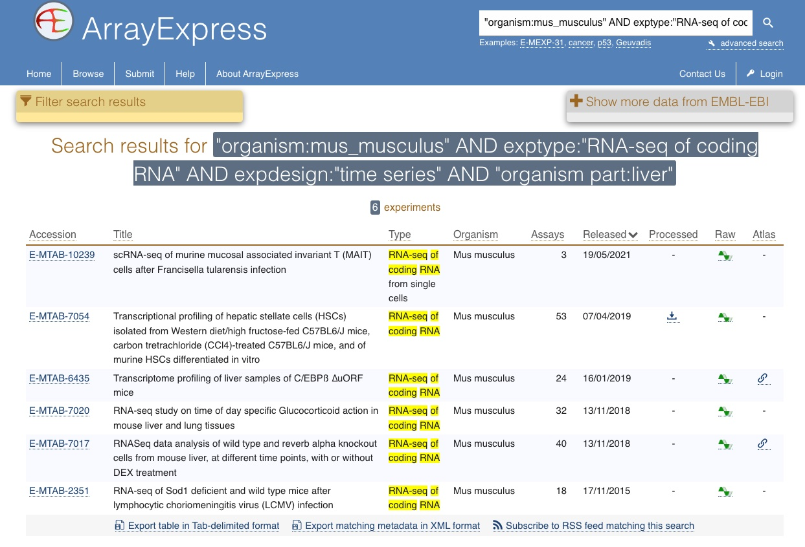

To try to guide the scientific community on how to ensure that the research data is useful for others in the digital age, the [FAIR principles](http://dx.doi.org/10.1038/sdata.2016.18) were published in 2016.

_“To be useful for others data should be FAIR - Findable, Accessible, Interoperable, and Reusable
… for both Machines and Humans”_

So what does this mean? A brief condensed summary:

#### Findable

- Data have a **globally unique persistent identifier**
  - e.g. a DOI, database accession number, etc
- Data are described by **metadata**
  - Information that explains the data
- Data and metadata are findable in a **search resource**
  - There must be ways of searching for the data

#### Accessible

- Data is retrievable through a **standardised communication protocol** (open, free, allowing authentication & authorisation where necessary)
  - e.g. http, sftp, etc
- Metadata are accessible, **even if data is no longer available**
  - Information about the data can be found even if data is no longer available

#### Interoperable

- Metadata use a formal, accessible, shared **language for knowledge representation**
  - Metadata is available in a form that even a computer can make use of
- Metadata use **vocabularies** that follow the FAIR principles
  - Standardised ways of capturing information about the data, that in themselves is FAIR
- Metadata include qualified **references** to other metadata
  - If the data relies on other data, there must be links to those

#### Reusable

- Data have a clear data usage **license**
  - It is obvious under what conditions the data can be reused
- Metadata are associated with **detailed provenance**
  - The metadata is detailed enough to understand for what research questions it is relevant to reuse
- Metadata meet domain-relevant community **standards**
  - Metadata is described according to existing standards in the research field

A couple of things to note about FAIR:
- Both humans and machines are intended users of data
- The principles are not necessarily about open data
  - “As open as possible, as closed as necessary”
- FAIRness is not something absolute
  - Different levels of FAIR maturity
- FAIR does not force any particular technical standards

A simple example of the use of FAIRified data is that it allows searching for very explicit datasets. The example search below will only retrieve *RNA-sequencing experiments* from *liver tissue* from the *common house mouse* with a *time series design*. Using the specific and controlled fields and terms used to describe the data makes it possible to be this specific. To find such data without these precise descriptions would make it very difficult to find. You would have to guess what terms the dataset creators might have used, and will probably have to go through a lot of irrelevant datasets.

*Picture source: [ArrayExpress @ EMBL-EBI](https://www.ebi.ac.uk/arrayexpress/search.html?query=%22organism%3Amus_musculus%22+AND+exptype%3A%22RNA-seq+of+coding+RNA%22+AND+expdesign%3A%22time+series%22+AND+%22organism+part%3Aliver%22+cle-open-access/more-open-access)*

The FAIR principles are quite a mouthful, and a different angle on what is considered to be part of the scientific process for most researchers. So what is a poor researcher to do?

Which is easier, use practices that supports the FAIR principles from the start of a project (“FAIR at source“), or after it is done, when someone asks for it, retroactively?

The first thing is to start thinking about, and planning for, what practices I can apply in my research to make this easier. And that is what the rest of this course is about.

- Data Management Plans, to do your thinking ahead of time
- Using standard metadata descriptions, to clearly define your data
- Organising your analysis, so you and others can understand what you have done
- Use versioning control to keep track of changes you do
- Clean up metadata and data to be consistent with the standards you have chosen
- Submit your data to international public repositories, so others can find and reuse your data
- Use scripted analysis of your data, that can be understood by others

> ## Exercise: Reflect on your current data management practices
>
> - What data management practices do you apply in your research projects today? Discuss with 2 of your neighbours.
> - Use this matrix as an inspiration. Where are you on the scale?
> 
> [*Borghi, J. et al (2018). Support your Data*](https://doi.org/10.3897/rio.4.e26439).
{: .challenge}

#### References

Wilkinson, Mark et al. “The FAIR Guiding Principles for scientific data management and stewardship”. Scientific Data 3, Article number: 160018 (2016) [http://dx.doi.org/10.1038/sdata.2016.18](http://dx.doi.org/10.1038/sdata.2016.18)
